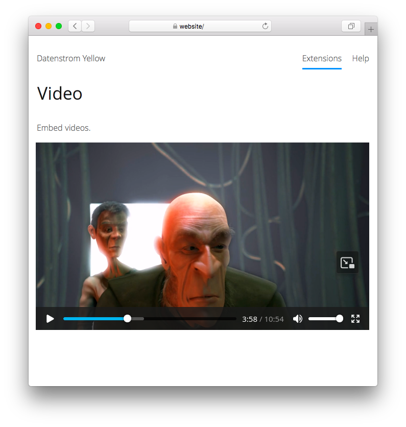

# Video 0.9.2

Add videos.

## How to install an extension

[Download ZIP file](https://github.com/GiovanniSalmeri/yellow-video/archive/refs/heads/main.zip) and copy it into your `system/extensions` folder. [Learn more about extensions](https://github.com/annaesvensson/yellow-update).

## How to add a video

Create a `[video]` shortcut. 

The following arguments are available, all but the first argument are optional:
 
`Source` = video source, name or url  
`Style` = video style, e.g. `left`, `center`, `right`  
`Width` = video width, pixel or percent  
`Height` = video height, pixel or percent  

The video formats MP4, WEBM and OGG are supported. All media files are located in the `media` folder. The `media/videos` folder is the place to store your videos. You can also create additional folders and organise files as you like.

For embedding videos from streaming services there is the [Embed](https://github.com/GiovanniSalmeri/yellow-embed) extension.

## Examples

Adding a video, different videos:

    [video my_video.webm]
    [video https://commondatastorage.googleapis.com/gtv-videos-bucket/sample/ElephantsDream.mp4]

Adding a video, different sizes:

    [video my_video.webm right 50%]
    [video my_video.webm right 200 112]
    [video my_video.webm right 400 224]

## Settings

The following settings can be configured in file `system/extensions/yellow-system.ini`:

`VideoStyle` = video style, e.g. `flexible`  
`VideoLocation`= location for videos  

## Acknowledgements

This extension is based on Youtube (now discontinued) by Anna Svensson. Thank you for the good work. 

## Developer

Giovanni Salmeri. [Get help](https://datenstrom.se/yellow/help/).
